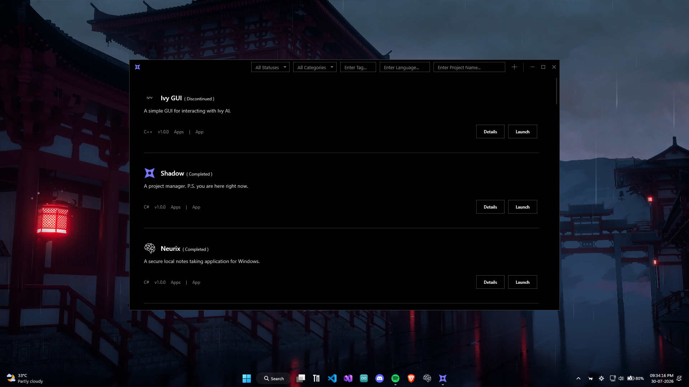
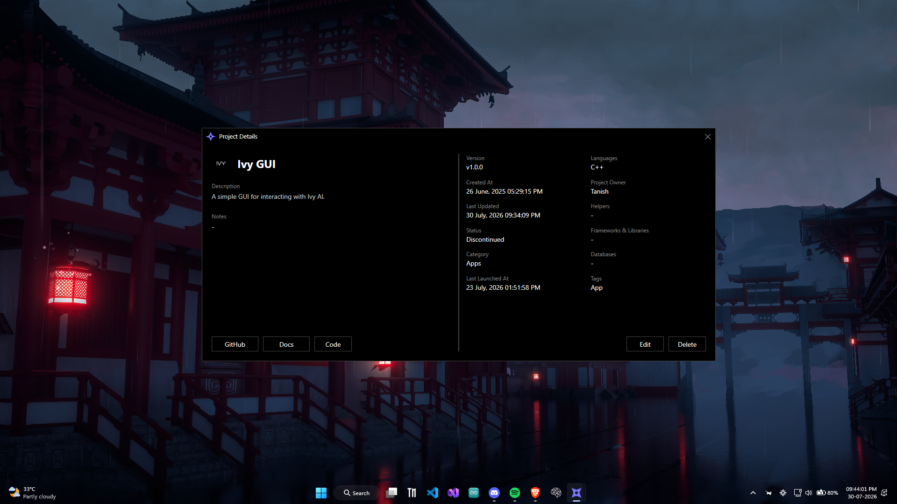

<h1>
  
  Shadow
</h1>

### A desktop project manager for developers and creators.

Shadow helps you organize and manage all of your projects from one place. Store project information, keep track of versions and progress, attach useful resources, and quickly jump back into your work without digging through folders.

  

## Why I made this

I often found myself forgetting important details about projects, what version I was on, or when I last worked on it. Existing project management tools were either too complex or designed for teams.

Shadow is my solution: a lightweight desktop application that keeps all of my projects organized in one place while remaining fast and simple to use.

## Current Features

- Save project descriptions and personal notes
- Track project versions
- Organize projects by category
- Record languages, frameworks, and databases
- Track project status (Active, On Hold, Completed, etc.)
- Store project owner and collaborators
- Save creation, update, and last launched dates
- Open GitHub repositories, documentation, and source folders with one click
- Tag projects for easier organization

## Project Details

  

## Built With

- C#
- .NET 8
- WPF (Windows Presentation Foundation)

## Contributing

If you encounter a bug or have a feature request, feel free to open an issue in this repository.
